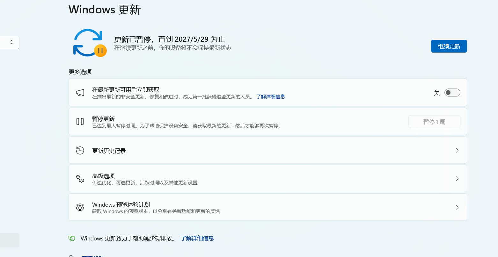
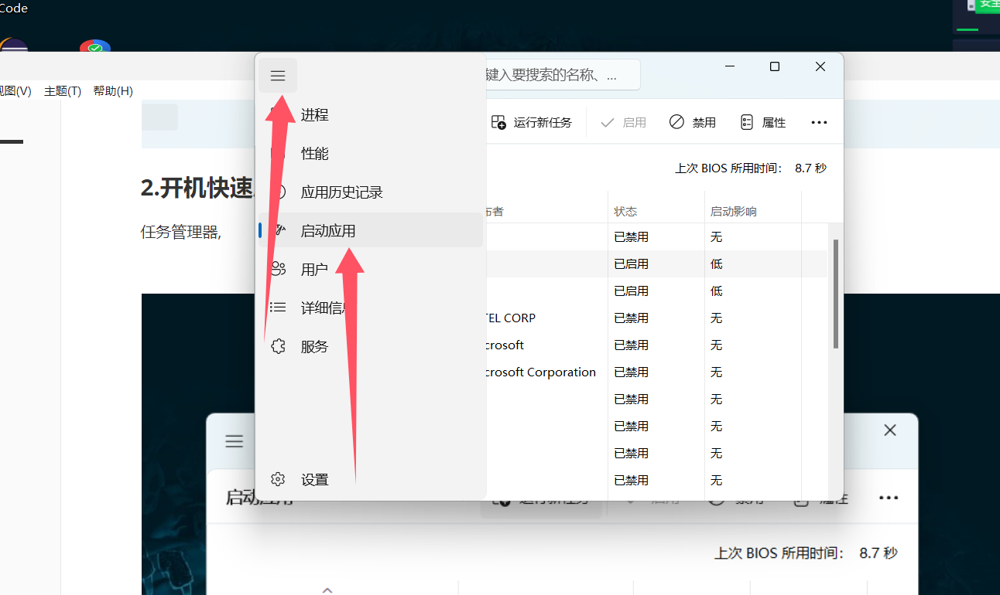
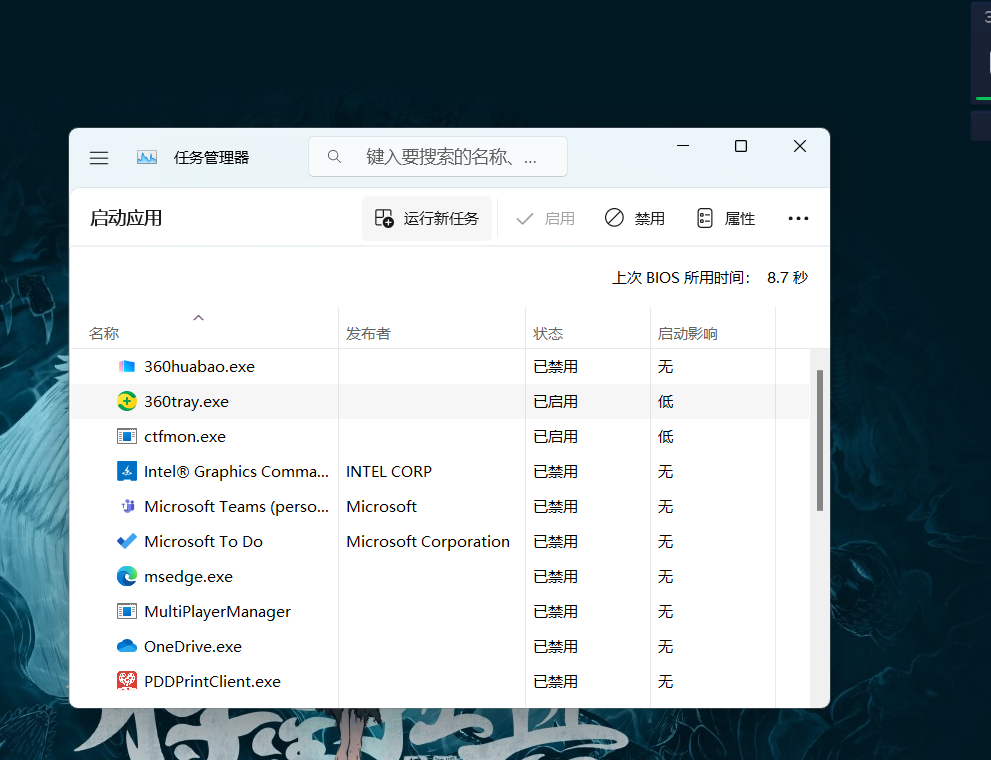

### 1.Windows11关闭自动更新

win+R 输入 regedit

地址

```
计算机\HKEY_LOCAL_MACHINE\SOFTWARE\Microsoft\WindowsUpdate\UX\Settings
```

新建Dword(32位)文件,重命名名字

```
FlightSettingsMaxPauseDays
```

双击打开,改成10进制,输入1000	

然后去修改更新天数就可以了



### 2.开机快速启动

任务管理器,关闭一些应用



